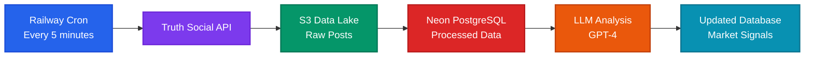

# Shitpost Alpha

**Real-time financial analysis of Trump's Truth Social posts using LLMs to predict market movements and send trading alerts. What could go wrong?**

> **🤖 Claude Code Optimized**: This repository is configured for optimal development with [Claude Code](https://claude.ai/code). See [CLAUDE.md](CLAUDE.md) for AI-assisted development guidelines and [.claude/](.claude/) for slash commands and workflows.

## 📖 The Story

Ever catch up on the market at the day and realize that you missed some crazy movement and wished you caught it in real time to take advantage? Have you then realized that the market movement was due to one (1) singular "Truth" post from the Shitposter In Chief himself, Donald Trump. A public shitpost that you totally could have seen and traded on. Yeah, me too. So I built Shitpost Alpha.

## 🎯 Overview

Shitpost Alpha is a comprehensive data pipeline that monitors Donald Trump's Truth Social account, harvests posts to S3, loads them into a database, and analyzes them using advanced LLMs to extract financial market implications. The system provides actionable trading signals and tracks prediction accuracy (soon) to continuously improve analysis quality (hopefully). We will also be adding notification features to communicate potential market moving implications the President's shitposts in real or near real time.

**Current Status:** The system is **live in production** on Railway, checking Trump's page every 5 minutes and updating a Neon PostgreSQL database with new shitposts and real-time LLM analysis.

**Purpose:** To make seven zillion dollars, or go broke trying (again).

## ⚠️ Disclaimer

This software is for educational and research purposes only. Trading decisions should not be based solely on automated analysis. This is not financial advice. Always conduct your own research and consider consulting with financial advisors. But anyways, could be fun?

## 🚀 Current Features

- **✅ Complete Data Pipeline** - API → S3 → Database → LLM → Database
- **✅ Production Deployment** - Live on Railway with automated 5-minute cron scheduling
- **✅ Neon PostgreSQL Database** - Serverless PostgreSQL with real-time data updates
- **✅ S3 Data Lake** - Scalable raw data storage with organized structure
- **✅ LLM-Powered Analysis** - GPT-4 financial sentiment analysis
- **✅ Market Sentiment Detection** - Identifies bullish/bearish signals for specific assets
- **✅ Retruth Detection** - Automatically bypasses retweets to focus on original content
- **✅ Categorical Tracking** - Tracks all posts including those bypassed by analysis
- **✅ Multiple Processing Modes** - Incremental, backfill, and date range processing
- **✅ Unified Orchestration** - Single entry point for complete pipeline execution
- **✅ Modular Architecture** - Easy to extend and maintain
- **✅ Comprehensive Logging** - Beautiful console output with persistent file logs for debugging
- **✅ Production-Ready Logging** - Service-specific timestamped logs with visual sectioning


## 🏗 System Architecture

The system follows a **complete data pipeline architecture** with three main phases:

```
API → S3 → Database → LLM → Database
```

### 🚀 **Production Deployment Architecture**



**Deployment Stack:**
- **Platform**: Railway (serverless cron execution)
- **Scheduling**: Automated 5-minute intervals
- **Storage**: AWS S3 (scalable data lake)
- **Database**: Neon PostgreSQL (serverless, auto-scaling)

### 🎭 Themed Directory Structure

The project uses a delightfully themed directory structure that's both logical, modular, and memorable :)

- **`shit/`** - Universal container for supporting infrastructure
- **`shitvault/`** - Secure data storage and S3 processing
- **`shitposts/`** - Content harvesting and monitoring
- **`shitpost_ai/`** - AI analysis and LLM integration
- **`shitty_ui/`** - Dashboard for prediction performance visualization

```
shitpost_alpha/
├── shitpost_alpha.py       # 🎯 MAIN ENTRY POINT - Pipeline orchestrator
├── shit/                   # Core infrastructure & shared utilities
│   ├── config/             # Configuration management (Pydantic settings)
│   ├── content/            # Content processing (bypass logic)
│   ├── db/                 # Database models, client & operations
│   ├── llm/                # LLM client & prompt templates
│   ├── logging/            # Centralized logging system
│   ├── market_data/        # Market price fetching & outcome calculation
│   ├── s3/                 # S3 client, data lake & models
│   └── utils/              # Error handling utilities
├── shitvault/              # Data persistence & S3 processing
│   ├── cli.py              # Database CLI operations
│   ├── prediction_operations.py  # Prediction CRUD operations
│   ├── s3_processor.py     # S3 → Database processor
│   ├── shitpost_models.py  # Domain-specific SQLAlchemy models
│   ├── shitpost_operations.py  # Shitpost CRUD operations
│   └── statistics.py       # Database statistics & analytics
├── shitposts/              # Content harvesting
│   ├── truth_social_s3_harvester.py  # API → S3 harvester
│   └── cli.py              # Harvesting CLI functionality
├── shitpost_ai/            # AI analysis engine
│   ├── shitpost_analyzer.py # Analysis orchestrator
│   └── cli.py              # Analysis CLI utilities
├── shitty_ui/              # Prediction performance dashboard
│   ├── app.py              # Dash application entry point
│   ├── layout.py           # Dashboard layout, components & callbacks
│   └── data.py             # Database query functions for dashboard
└── shit_tests/             # Comprehensive test suite (973+ tests)
    ├── conftest.py          # Shared fixtures & test configuration
    ├── shit/                # Core infrastructure tests
    ├── shitposts/           # Harvesting module tests
    ├── shitvault/           # Database module tests
    ├── shitpost_ai/         # AI analysis tests
    ├── shitty_ui/           # Dashboard tests
    ├── integration/         # End-to-end pipeline tests
    └── fixtures/            # Test data & mock responses
```

## 📊 Current System Status

### Production Metrics
- **Posts Processed**: ~28,000+ historical posts harvested
- **Analysis Coverage**: ~2,900+ predictions (1,500+ completed, 1,400+ bypassed/pending)
- **Database**: Neon PostgreSQL with real-time updates
- **Storage**: AWS S3 data lake with organized structure
- **Uptime**: Railway deployment running every 5 minutes
- **Test Suite**: 973+ passing tests with comprehensive coverage
- **Latest Version**: v0.18.0 (Comprehensive Test Coverage)

## 📚 Technical Documentation

For comprehensive information about each component, see the detailed README files:

### 🎯 [Main Orchestrator](shitpost_alpha.py)
- Complete pipeline execution
- Command-line interface
- Error handling and logging

### 🚀 [Content Harvesting](shitposts/README.md)
- Truth Social S3 harvester
- Multiple harvesting modes (incremental, backfill, range)
- S3 data lake integration
- Resume capability for large backfills

### 💾 [Data Processing](shitvault/README.md)
- S3 to Database processor
- Database models and management
- Categorical analysis tracking
- Database CLI operations

### 🧠 [AI Analysis](shitpost_ai/README.md)
- LLM client and analysis engine
- Prompt engineering
- Enhanced context analysis
- Bypass functionality for unanalyzable content

## 📋 Recent Updates

For detailed version history and recent improvements, see [CHANGELOG.md](CHANGELOG.md).

## 🚧 Development Roadmap

### Phase 1: Core Pipeline ✅ **COMPLETED**
- [x] Truth Social monitoring and S3 storage
- [x] S3 to Database processing
- [x] LLM analysis pipeline with categorical tracking
- [x] Complete API → S3 → Database → LLM → Database pipeline
- [x] Unified orchestration via `shitpost_alpha.py`
- [x] Production deployment on Railway with Neon PostgreSQL
- [x] Comprehensive error handling and logging
- [x] Centralized bypass service for content filtering
- [x] 973+ passing tests with comprehensive coverage

### Phase 2: Market Data & Prediction Validation 🚧 **IN PROGRESS**
- [x] **Market Data Module** - `shit/market_data/` with yfinance integration
- [x] **Price Storage** - `market_prices` table with OHLCV data
- [x] **Outcome Tracking** - `prediction_outcomes` table with T+1/3/7/30 returns
- [x] **Outcome Calculator** - Automated accuracy/P&L calculation
- [x] **Price Backfill** - CLI tools for historical price backfilling
- [ ] **Full Asset Coverage** - Backfill prices for all 187+ mentioned assets
- [ ] **Automated Daily Updates** - Scheduled price fetching and outcome calculation

### Phase 3: Dashboard & Visualization 🚧 **IN PROGRESS**
- [x] **Dash-based Dashboard** - `shitty_ui/` with Plotly + Bootstrap
- [x] **Performance Metrics** - Accuracy, P&L, average return at a glance
- [x] **Accuracy by Confidence** - Chart showing calibration by confidence level
- [x] **Performance by Asset** - Chart showing per-asset accuracy
- [x] **Recent Signals** - Latest predictions with outcomes
- [x] **Asset Deep Dive** - Historical predictions for any selected asset
- [x] **Dark Theme** - Professional trading platform design
- [ ] **Loading States & Error Handling** - Graceful degradation
- [ ] **Time Period Filtering** - 7d/30d/90d/All selector
- [ ] **Mobile Responsiveness** - Optimized mobile layout

### Phase 4: Real-Time Alerting 📋 **PLANNED**
- [ ] **Telegram Bot** - Real-time prediction alerts
- [ ] **Alert Rules Engine** - Confidence threshold, asset filters
- [ ] **Subscriber Management** - Subscription and preference management
- [ ] **Rate Limiting** - Max alerts per hour/day per user

### Phase 5: Advanced Features 🔮 **FUTURE**
- [ ] **Multi-Source Aggregation** - Additional data sources beyond Truth Social
- [ ] **Ensemble Models** - Multiple LLMs with aggregated predictions
- [ ] **Public API** - REST API for external integrations
- [ ] **Monetization** - Tiered access (free/premium/pro)
- [ ] **Generational Wealth** - Heh...

## 📞 Contact

- **Email**: [christophertrogers37@gmail.com](mailto:christophertrogers37@gmail.com)
- **Website**: [https://crog.gg](https://crog.gg)
- **LinkedIn**: [https://linkedin.com/in/chrisrogers37](https://linkedin.com/in/chrisrogers37)

## 📝 License

This project is licensed under the MIT License - see the [LICENSE](LICENSE) file for details.

