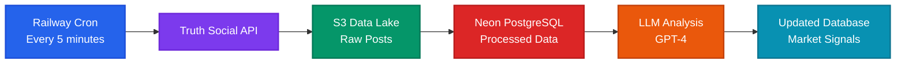

# Shitpost Alpha

**Real-time financial analysis of Trump's Truth Social posts using LLMs to predict market movements and send trading alerts. What could go wrong?**

> **🤖 Claude Code Optimized**: This repository is configured for optimal development with [Claude Code](https://claude.ai/code). See [CLAUDE.md](CLAUDE.md) for AI-assisted development guidelines and [.claude/](.claude/) for slash commands and workflows.

## 📖 The Story

Ever catch up on the market at the day and realize that you missed some crazy movement and wished you caught it in real time to take advantage? Have you then realized that the market movement was due to one (1) singular "Truth" post from the Shitposter In Chief himself, Donald Trump. A public shitpost that you totally could have seen and traded on. Yeah, me too. So I built Shitpost Alpha.

## 🎯 Overview

Shitpost Alpha is a comprehensive data pipeline that monitors Donald Trump's Truth Social account, harvests posts to S3, loads them into a database, and analyzes them using advanced LLMs to extract financial market implications. The system provides actionable trading signals and tracks prediction accuracy (soon) to continuously improve analysis quality (hopefully). We will also be adding notification features to communicate potential market moving implications the President's shitposts in real or near real time.

**Current Status:** The system is **live in production** on Railway, checking Trump's page every 5 minutes and updating a Neon PostgreSQL database with new shitposts and real-time LLM analysis.

**Purpose:** To make seven zillion dollars, or go broke trying (again).

## ⚠️ Disclaimer

This software is for educational and research purposes only. Trading decisions should not be based solely on automated analysis. This is not financial advice. Always conduct your own research and consider consulting with financial advisors. But anyways, could be fun?

## 🚀 Current Features

- **✅ Complete Data Pipeline** - API → S3 → Database → LLM → Database
- **✅ Production Deployment** - Live on Railway with automated 5-minute cron scheduling
- **✅ Neon PostgreSQL Database** - Serverless PostgreSQL with real-time data updates
- **✅ S3 Data Lake** - Scalable raw data storage with organized structure
- **✅ Multi-LLM Analysis** - GPT-4, Claude, and Grok/xAI with provider comparison CLI
- **✅ Market Sentiment Detection** - Identifies bullish/bearish signals for specific assets
- **✅ Market Data Tracking** - Price fetching (yfinance + Alpha Vantage fallback), outcome calculation, and prediction accuracy scoring
- **✅ Telegram Alerts** - Real-time prediction alerts via Telegram bot with subscriber management
- **✅ Performance Dashboard** - Multi-page Dash app with signal-over-trend charts, KPIs, and asset deep dives
- **✅ Source-Agnostic Signal Model** - Platform-independent data model ready for multi-source expansion
- **✅ Harvester Abstraction** - Pluggable harvester framework with registry and skeleton Twitter template
- **✅ Retruth Detection** - Automatically bypasses retweets to focus on original content
- **✅ Multiple Processing Modes** - Incremental, backfill, and date range processing
- **✅ Unified Orchestration** - Single entry point with multi-source support
- **✅ Comprehensive Logging** - Service-specific timestamped logs with visual sectioning
- **✅ Market Data Resilience** - Multi-provider fallback, exponential backoff retry, health monitoring


## 🏗 System Architecture

The system follows a **complete data pipeline architecture** with three main phases:

```
API → S3 → Database → LLM → Database
```

### 🚀 **Production Deployment Architecture**



**Deployment Stack:**
- **Platform**: Railway (serverless cron execution)
- **Scheduling**: Automated 5-minute intervals
- **Storage**: AWS S3 (scalable data lake)
- **Database**: Neon PostgreSQL (serverless, auto-scaling)

### 🎭 Themed Directory Structure

The project uses a delightfully themed directory structure that's both logical, modular, and memorable :)

- **`shit/`** - Universal container for supporting infrastructure
- **`shitvault/`** - Secure data storage and S3 processing
- **`shitposts/`** - Content harvesting and monitoring
- **`shitpost_ai/`** - AI analysis and LLM integration
- **`shitty_ui/`** - Dashboard for prediction performance visualization

```
shitpost_alpha/
├── shitpost_alpha.py       # 🎯 MAIN ENTRY POINT - Pipeline orchestrator
├── shit/                   # Core infrastructure & shared utilities
│   ├── config/             # Configuration management (Pydantic settings)
│   ├── content/            # Content processing (bypass logic)
│   ├── db/                 # Database models, client & operations
│   ├── llm/                # LLM client & prompt templates
│   ├── logging/            # Centralized logging system
│   ├── market_data/        # Market price fetching & outcome calculation
│   ├── s3/                 # S3 client, data lake & models
│   └── utils/              # Error handling utilities
├── shitvault/              # Data persistence & S3 processing
│   ├── cli.py              # Database CLI operations
│   ├── shitpost_models.py  # Domain-specific SQLAlchemy models
│   ├── shitpost_operations.py  # Shitpost CRUD operations
│   ├── signal_models.py    # Source-agnostic Signal model
│   ├── signal_operations.py  # Signal CRUD operations
│   ├── prediction_operations.py  # Prediction CRUD operations
│   ├── s3_processor.py     # S3 → Database processor (dual-write)
│   └── statistics.py       # Database statistics & analytics
├── shitposts/              # Content harvesting
│   ├── base_harvester.py   # Abstract SignalHarvester base class
│   ├── harvester_registry.py  # Config-driven harvester management
│   ├── harvester_models.py # Harvest result/config data models
│   ├── truth_social_s3_harvester.py  # Truth Social → S3 harvester
│   ├── twitter_harvester.py  # Skeleton Twitter/X harvester
│   └── cli.py              # Harvesting CLI functionality
├── shitpost_ai/            # AI analysis engine
│   ├── shitpost_analyzer.py # Analysis orchestrator
│   ├── compare_cli.py      # Multi-provider comparison CLI
│   └── cli.py              # Analysis CLI utilities
├── shitty_ui/              # Prediction performance dashboard
│   ├── app.py              # Dash application & Flask endpoints
│   ├── layout.py           # App factory, router & callback registration
│   ├── data.py             # Database query functions (2000+ lines)
│   ├── constants.py        # Colors, typography, spacing tokens
│   ├── pages/              # Page modules
│   │   ├── dashboard.py    # Main dashboard (tabbed analytics)
│   │   ├── signals.py      # Signal feed with filtering
│   │   ├── trends.py       # Signal-over-trend charts
│   │   └── assets.py       # Asset deep dive page
│   ├── components/         # Reusable UI components
│   │   ├── cards.py        # Signal, prediction & metric cards
│   │   ├── charts.py       # Candlestick & overlay charts
│   │   ├── controls.py     # Filter & period controls
│   │   └── header.py       # Navigation header
│   └── callbacks/          # Callback groups
│       └── alerts.py       # Alert configuration panel
├── notifications/          # Alert dispatch & Telegram bot
│   ├── alert_engine.py     # Alert check-and-dispatch loop
│   ├── dispatcher.py       # Multi-channel delivery
│   ├── telegram_bot.py     # Telegram command handlers
│   ├── telegram_sender.py  # Telegram API integration
│   ├── db.py               # Subscription & alert DB operations
│   └── __main__.py         # CLI (check-alerts, set-webhook, etc.)
└── shit_tests/             # Comprehensive test suite (1400+ tests)
    ├── conftest.py          # Shared fixtures & test configuration
    ├── shit/                # Core infrastructure tests
    ├── shitposts/           # Harvesting module tests
    ├── shitvault/           # Database module tests
    ├── shitpost_ai/         # AI analysis tests
    ├── shitty_ui/           # Dashboard tests
    ├── notifications/       # Alert system tests
    ├── integration/         # End-to-end pipeline tests
    └── fixtures/            # Test data & mock responses
```

## 📊 Current System Status

### Production Metrics
- **Posts Processed**: ~28,000+ historical posts harvested
- **Analysis Coverage**: ~2,900+ predictions (1,500+ completed, 1,400+ bypassed/pending)
- **Database**: Neon PostgreSQL with real-time updates
- **Storage**: AWS S3 data lake with organized structure
- **Uptime**: Railway deployment running every 5 minutes
- **Test Suite**: 1400+ tests with comprehensive coverage
- **Latest Version**: v1.0.0

## 📚 Technical Documentation

For comprehensive information about each component, see the detailed README files:

### 🎯 [Main Orchestrator](shitpost_alpha.py)
- Complete pipeline execution
- Command-line interface
- Error handling and logging

### 🚀 [Content Harvesting](shitposts/README.md)
- Truth Social S3 harvester
- Multiple harvesting modes (incremental, backfill, range)
- S3 data lake integration
- Resume capability for large backfills

### 💾 [Data Processing](shitvault/README.md)
- S3 to Database processor
- Database models and management
- Categorical analysis tracking
- Database CLI operations

### 🧠 [AI Analysis](shitpost_ai/README.md)
- Multi-LLM client (GPT-4, Claude, Grok/xAI) with provider comparison
- Prompt engineering
- Enhanced context analysis
- Bypass functionality for unanalyzable content

### 📊 [Performance Dashboard](shitty_ui/README.md)
- Multi-page Dash app (Dashboard, Signals, Trends, Assets)
- Signal-over-trend candlestick charts with prediction overlays
- Performance KPIs and analytics

### 🔔 [Notifications](documentation/TELEGRAM_SETUP_GUIDE.md)
- Telegram bot with subscriber management
- Alert engine with configurable thresholds
- Browser push alerts via dashboard

### 📈 [Market Data](documentation/MARKET_DATA_ARCHITECTURE.md)
- Multi-provider price fetching (yfinance + Alpha Vantage)
- Prediction outcome tracking and accuracy scoring
- Health monitoring and resilience

## 📋 Recent Updates

For detailed version history and recent improvements, see [CHANGELOG.md](CHANGELOG.md).

## 🚧 Development Roadmap

### Phase 1: Core Pipeline ✅ **COMPLETED**
- [x] Truth Social monitoring and S3 storage
- [x] S3 to Database processing
- [x] LLM analysis pipeline with categorical tracking
- [x] Complete API → S3 → Database → LLM → Database pipeline
- [x] Unified orchestration via `shitpost_alpha.py`
- [x] Production deployment on Railway with Neon PostgreSQL
- [x] Comprehensive error handling and logging
- [x] Centralized bypass service for content filtering

### Phase 2: Market Data & Prediction Validation ✅ **COMPLETED**
- [x] **Market Data Module** - `shit/market_data/` with yfinance + Alpha Vantage fallback
- [x] **Price Storage** - `market_prices` table with OHLCV data
- [x] **Outcome Tracking** - `prediction_outcomes` table with T+1/3/7/30 returns
- [x] **Outcome Calculator** - Automated accuracy/P&L calculation
- [x] **Price Backfill** - CLI tools for historical price backfilling
- [x] **Reactive Ticker Lifecycle** - Auto-backfill when new tickers appear in predictions
- [x] **Market Data Resilience** - Multi-provider fallback, retry with exponential backoff, health monitoring
- [x] **Automated Updates** - Railway cron every 15 minutes for price fetching and outcome calculation

### Phase 3: Dashboard & Visualization ✅ **COMPLETED**
- [x] **Multi-page Dash App** - `shitty_ui/` with Plotly + Bootstrap (Dashboard, Signals, Trends, Assets)
- [x] **Performance Metrics** - Accuracy, P&L, average return KPIs
- [x] **Tabbed Analytics** - Accuracy by confidence, performance by asset, accuracy over time
- [x] **Signal Feed** - Filterable signal cards with sentiment colors and confidence badges
- [x] **Signal-Over-Trend Charts** - Candlestick price charts with prediction marker overlays
- [x] **Asset Deep Dive** - Historical predictions on dedicated `/assets/<ticker>` page
- [x] **Dark Theme** - Professional trading platform design with typography scale
- [x] **Smart Empty States** - Compact informative messages when data is missing

### Phase 4: Real-Time Alerting ✅ **COMPLETED**
- [x] **Telegram Bot** - Real-time prediction alerts with subscriber commands
- [x] **Alert Rules Engine** - Confidence threshold, asset filters, per-subscriber preferences
- [x] **Subscriber Management** - Multi-tenant subscription via Telegram
- [x] **Browser Alerts** - Dashboard alert panel with localStorage preferences
- [x] **Production Deployment** - Railway cron every 2 minutes, webhook endpoint, health check

### Phase 5: System Evolution ✅ **COMPLETED**
- [x] **Multi-LLM Support** - GPT-4, Claude, Grok/xAI with provider comparison CLI
- [x] **Source-Agnostic Signal Model** - Platform-independent data model with dual-FK migration
- [x] **Harvester Abstraction** - Pluggable base class, registry, skeleton Twitter template

### Phase 6: Future 🔮 **PLANNED**
- [ ] **Multi-Source Aggregation** - Twitter/X, RSS, and other data sources
- [ ] **Ensemble Models** - Multiple LLMs with aggregated predictions
- [ ] **Public API** - REST API for external integrations
- [ ] **Monetization** - Tiered access (free/premium/pro)
- [ ] **Generational Wealth** - Heh...

## 📞 Contact

- **Email**: [christophertrogers37@gmail.com](mailto:christophertrogers37@gmail.com)
- **Website**: [https://crog.gg](https://crog.gg)
- **LinkedIn**: [https://linkedin.com/in/chrisrogers37](https://linkedin.com/in/chrisrogers37)

## 📝 License

This project is licensed under the MIT License - see the [LICENSE](LICENSE) file for details.

